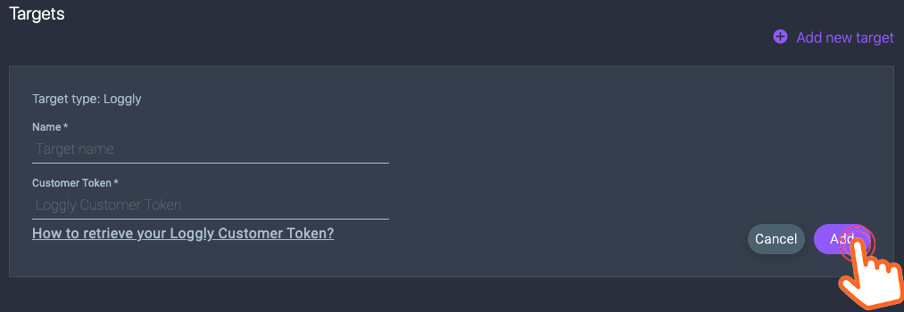

![logo][rookout-image]

## Setup

### Installation

Rookout sends data to Loggly via a HTTP Webhook.

1. Get a Customer Token from Loggly [see their docs](loggly-token-docs-url)

2. Setup [Rookout][rookout-url]

3. Log into [Rookout's webapp][rookout-app-url]

1. In the top left corner click on the menu button

    

1. Click on *Targets* in order to open the targets page

    

1. Click on *Add new target* to open the menu and choose *Loggly*

    

1. Fill in your new target's name, your [Loggly Token](loggly-token-docs-url) and click *Add*

    

1. Now you can choose your *Loggly* target when editing a breakpoint.

  1. To edit your breakpoint click on the *Edit* icon.
    
  1. Choose the requested target from the target menu, and click *Set* to save your settings.
    

## Troubleshooting
1. Once your breakpoint was triggered you will see your data in *Loggly* tagged with the *http* tag.
1. If you don't see data from Rookout please check that your *Loggly* endpoint is working. See [*Loggly*'s documents](loggly-http-docs-url) for instructions.
## Further Reading
Find out more at [https://docs.rookout.com][rookout-docs]

[rookout-image]: logos/avatars-bot.png
[rookout-url]: https://docs.rookout.com/docs/getting-started.html
[rookout-docs]: https://docs.rookout.com/
[rookout-app-url]: https://app.rookout.com
[loggly-token-docs-url]: https://www.loggly.com/docs/customer-token-authentication-token/
[loggly-http-docs-url]:https://www.loggly.com/docs/http-endpoint/
